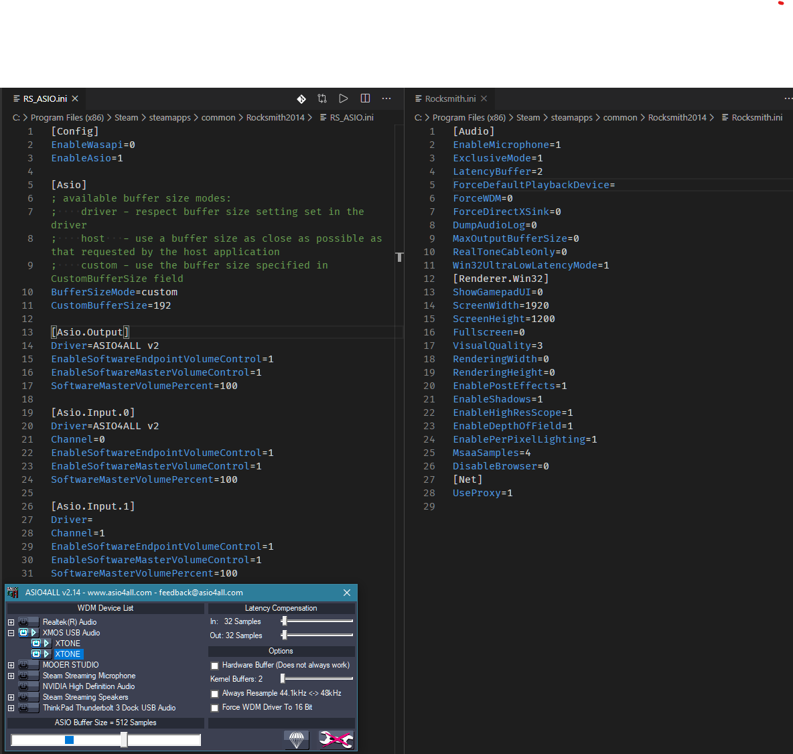

# RS ASIO

This project aims to add ASIO support to `Rocksmith 2014 Edition - Remastered` in order to avoid issues with some WASAPI drivers.
It patches game code at runtime to allow intervening in the process of WASAPI device enumeration so that we can inject our own fake WASAPI devices which internally use ASIO audio API.

### Download

You can download the [latest release here](https://github.com/mdias/rs_asio/releases/latest).

### How to use

- Copy the DLL files to the game folder.
- Modify the RS_ASIO.ini file to configure which ASIO driver to use, and which channels etc...
- Make sure Rocksmith.ini is set to run with `ExclusiveMode=1` and `Win32UltraLowLatencyMode=1`. If in doubt, use default settings.
- Make sure your interface clock is set to 48kHz. RS ASIO will try to request 48kHz mode, but your drivers may or may not allow this, so it might help setting it manually.
- Extra: An RS_ASIO-log.txt file is generated inside the game directory which may help discover your ASIO driver name and diagnose issues.
- Look into [basic configuration guide](#basic-configuration-guide)

### How to remove/uninstall

- Remove the custom DLL files from the game folder.

### Audio Interfaces reported to work well

- Audient iD4
- Behringer U-Phoria UM2 [(see this for more details)](https://github.com/mdias/rs_asio/issues/7)
- Behringer UMC1820
- Behringer UMC202HD
- Behringer UMC204HD
- ESI MAYA22 USB
- Focusrite Saffire Pro 40
- Focusrite Scarlett 2i2 2nd Gen [(Known issues)](#known-issues)
- Focusrite Scarlett 2i2 3rd Gen [(Known issues)](#known-issues)
- Focusrite Scarlett 2i4 1st Gen [(Known issues)](#known-issues)
- Focusrite Scarlett 2i4 2nd Gen [(Known issues)](#known-issues)
- Focusrite Scarlett 4i4 3rd Gen [(Known issues)](#known-issues)
- Focusrite Scarlett 6i6 2nd Gen [(Known issues)](#known-issues)
- Focusrite Scarlett Solo 2nd Gen [(Known issues)](#known-issues)
- Juli@ XTe
- Lexicon Alpha
- Line6 HX Stomp
- M-Audio 2x2
- M-Audio M-Track Plus II
- [M-Audio MobilePre mkII](https://github.com/mdias/rs_asio/issues/15)
- Mackie Onyx Producer 2x2
- Native Instruments Komplete Audio 6
- MOTU 2408 mk3
- MOTU UltraLite AVB
- Presonus Quantum 2
- RME Multiface with HDSPe PCIe
- Roland Rubix 44
- [Steinberg UR22mkII](https://github.com/mdias/rs_asio/issues/15)
- Universal Audio Apollo Twin USB
- Zoom U-44
- [XTONE Smart Stomp](#XTONE-Smart-stomp)

### Known issues

- Your interface MUST support 48kHz playback
- Doesn't provide a way to open the ASIO control panel (please configure your interface elsewhere for now, if needed).
- Will need a game reboot if ASIO settings are changed while the game is running (such as changing sample rate, sample type etc).
- Some Focusrite devices have been reported to only output sound properly when using ASIO buffer sizes of 48, 96 or 192. You can use the custom buffer size setting on RS_ASIO.ini for this.
- Hardware hotplugging while the game is running won't be noticed by the game.
- Game sometimes crash on exit (under investigation)

## Interface guides

### Basic configuration guide

1. Follow installation steps, described above.
1. Run Rocksmith for the first time. 
1. Look into RS_ASIO-log.txt, you will see names of drivers

```txt
0.456 [INFO]  AsioHelpers::FindDrivers
0.456 [INFO]    ASIO4ALL v2
0.457 [INFO]    MOOER USB Audio
0.457 [INFO]    XMOS USB Audio 2.0 ST 3086
0.457 [INFO]    ZOOM R16_R24 ASIO Driver
```

4. Copy name of the corresponding driver to the [Asio...] block of the RS_ASIO.ini
1. Run Rocksmith again
1. Repeat until there is no cracks in audio. Your goal is to have smallest possible values without cracks. Find smallest possible LatencyBuffer and then gradually set buffer size until there is no cracks.
    1. Modify LatencyBuffer (try values 4,3,2,1)
    1. Modify buffersize either in ASIO driver control panel or in CustomBufferSize option in the RS_ASIO.ini file
    1. Run Rocksmith

### XTONE Smart Stomp

Those settings worked on Lenovo Thinkpad X1 Extreme for [XTONE Smart Stomp](https://www.xsonic.cc/XTONE).

I found setting custom buffer size from file more convenient than messing with ASIO4All slider.

In theory, this approach should work for every ASIO4All device. Note that I've disabled all other ASIO4All devices for simplicity

#### Rocksmith.ini

```txt
    LatencyBuffer=2
```

#### RS_ASIO.ini

```txt
[Asio.Output]
Driver=ASIO4ALL v2
...

[Asio.Input.0]
Driver=ASIO4ALL v2
...
```


